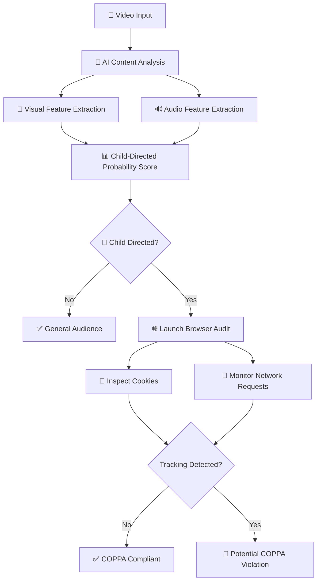
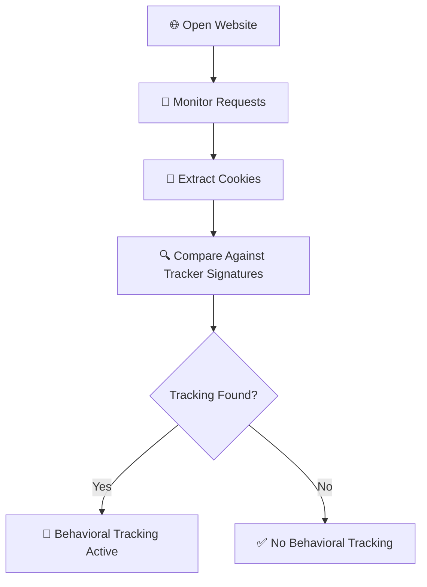
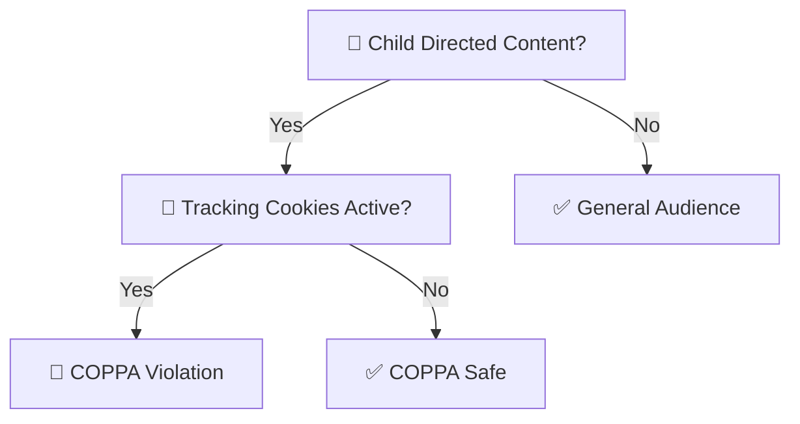

# 🛡️ AI-Powered COPPA Compliance Audit System

> A Multimodal AI + Runtime Privacy Auditing Framework for Detecting Child-Directed Content and Potential COPPA Violations

---

# 📌 Overview

This project implements a real-time COPPA compliance auditing system that combines:

- 🎥 AI-based child-directed content detection
- 🌐 Live website privacy auditing
- 🍪 Tracking cookie inspection
- 📡 Behavioral advertisement detection
- 🔍 Network request monitoring

The system determines whether:

1. A video is likely targeted toward children under 13.
2. The hosting platform uses behavioral tracking technologies.
3. A potential COPPA privacy violation exists.

---

# 🚨 Problem Statement

Many modern platforms host:

- children's cartoons
- toy videos
- nursery rhymes
- educational animations

while simultaneously running:

- targeted advertisements
- behavioral tracking
- third-party analytics
- persistent user identifiers

Under the Children's Online Privacy Protection Act (COPPA), this may constitute a privacy violation if proper safeguards are not enforced.

This project aims to automatically detect such situations using AI + browser auditing.

---

# 🧠 Core Features

## 🎥 AI Child-Directed Content Detection

The system analyzes:

- video frames
- visual features
- audio characteristics

to estimate whether content is intended for children.

### Extracted Visual Features

- ✅ Bright primary colors
- ✅ Cartoon-like animations
- ✅ Toy-like visuals
- ✅ Rounded child-character structures
- ✅ Vibrant scene density

### Extracted Audio Features

- ✅ High-pitched voices
- ✅ Bright cartoon sound effects
- ✅ Energetic audio profiles

---

## 🌐 Runtime Privacy Auditing

A real browser session is launched using Playwright to inspect:

- cookies
- network requests
- third-party trackers
- advertisement systems

The system detects trackers such as:

```text
_ga
_gid
_fbp
IDE
doubleclick.net
google-analytics
facebook.com/tr
```

---

## 🍪 Live Cookie Inspection

The browser automatically extracts cookies from the webpage:

```python
live_cookies = await context.cookies()
```

and checks whether tracking identifiers are active.

---

## 📡 Network Request Monitoring

Every outgoing request is intercepted using:

```python
page.on("request", monitor_network_frames)
```

This helps identify:

- Google Analytics
- Facebook Pixel
- DoubleClick Ads
- Behavioral advertising systems

---

# ⚙️ System Architecture



---

# 🛠️ Technologies Used

| Technology | Purpose |
|---|---|
| 🐍 Python | Core implementation |
| 🎥 OpenCV | Video frame processing |
| 📊 NumPy / Pandas | Data analysis |
| 🌐 Playwright | Browser automation |
| 📡 Chromium | Runtime privacy auditing |
| 📈 Matplotlib | Visualization |
| 🔊 FFT Audio Processing | Audio feature extraction |

---

# 🔍 How the Detection Works

---

## 🎨 Visual Analysis Pipeline

The system samples video frames and computes:

### 🌈 Bright Primary Color Density

Children’s content often contains:

- red
- yellow
- blue
- green

with highly saturated visuals.

---

### 🧸 Toy-like Color Diversity

Toy videos and children’s animations generally contain:

- strong color variety
- simplified scene structures
- visually energetic layouts

---

### 📺 Cartoon Detection

The system estimates whether frames appear animated using:

- edge density
- saturation
- texture smoothness

---

### 🔵 Rounded Character Shapes

Rounded objects and circular character structures are common in child-oriented content.

---

# 🔊 Audio Analysis Pipeline

The audio stream is extracted using FFmpeg and analyzed using FFT.

---

## 🎤 High-Pitched Audio Detection

The system measures:

- voice pitch
- frequency distribution
- energetic cartoon speech

---

## 🎵 Bright Sound Effect Detection

Child-oriented videos commonly contain:

- energetic sound effects
- bright synthetic sounds
- playful audio patterns

---

# 📊 Probability Scoring Engine

The final probability score is computed using weighted heuristics:

```python
child_probability =
    0.24 * bright_primary_colors +
    0.18 * cartoons_animation +
    0.16 * toy_like_visuals +
    0.12 * rounded_shapes +
    0.22 * high_pitched_audio +
    0.08 * bright_sfx_audio
```

---

# 🌐 Runtime Browser Auditing

The system launches a real invisible Chromium browser:

```python
browser = await p.chromium.launch(headless=True)
```

It then:

1. Opens the target platform
2. Waits for scripts to load
3. Monitors outgoing requests
4. Extracts cookies
5. Searches for tracking signatures

---

# 🔄 Runtime Audit Flow



---

# 🧪 Simulation Mode

If internet access or browser execution fails, the notebook automatically falls back to a simulated telemetry environment.

Example simulation:

```python
live_telemetry = {
    "tracking_cookies_found": [
        {"name": "IDE", "domain": ".doubleclick.net"},
        {"name": "_ga", "domain": ".google.com"}
    ]
}
```

This ensures:

- ✅ Reliable demonstrations
- ✅ Offline execution support
- ✅ Stable academic presentations

---

# 🚨 COPPA Violation Logic

A violation is flagged only if:

```text
Child-Directed Content
        +
Behavioral Tracking Active
```

---

## Final Decision Logic



---

# 📂 Output Generated

The system generates:

- ✅ JSON compliance reports
- ✅ Privacy audit summaries
- ✅ Feature probability visualizations
- ✅ Behavioral tracking telemetry

Example:

```json
{
  "audience_classification": "CHILD_DIRECTED",
  "confidence_score": 0.81,
  "behavioral_tracking_active": true,
  "coppa_violation_state": true
}
```

---

# 📈 Example Console Output

```text
COPPA AUDIT COMPLIANCE REPORT

AI Core Content Target Classification : CHILD_DIRECTED
Measured Child-Directed Index Value   : 0.8199
Live Behavioral Trackers Found on Wire: 2 active identifiers

CRITICAL VIOLATION ALERT:
Content targets children, but tracking systems are active.
```

---

# 🚀 Installation

## Clone Repository

```bash
git clone https://github.com/yourusername/coppa-compliance-audit-system.git
cd coppa-compliance-audit-system
```

---

## Install Dependencies

```bash
pip install playwright pandas opencv-python matplotlib numpy
playwright install chromium
```

---

# ▶️ Running the Notebook

Launch Jupyter Notebook:

```bash
jupyter notebook
```

Run:

```text
real_coppa_compliance_audit_system.ipynb
```

---

# 🧪 Usage

1. Upload an `.mp4` video
2. Enter a platform URL
3. System performs:
   - AI child-content analysis
   - Runtime browser auditing
   - Tracking detection
   - COPPA compliance verification

---

# 📁 Project Structure

```text
📦 coppa-compliance-audit-system
 ┣ 📜 real_coppa_compliance_audit_system.ipynb
 ┣ 📜 README.md
 ┣ 📂 outputs
 ┃ ┣ 📜 compliance_report.json
 ┃ ┗ 📊 feature_visualization.png
 ┗ 📂 sample_videos
```

---

# 🔒 Ethical Considerations

This project is intended for:

- ✅ Educational research
- ✅ Platform auditing
- ✅ Privacy compliance demonstrations
- ✅ Trust & safety research

It is not intended for:

- ❌ Surveillance
- ❌ Unauthorized monitoring
- ❌ Exploitative tracking analysis

---

# 📚 Future Improvements

- 🤖 Deep learning-based video classification
- 🧠 NLP subtitle analysis
- 📱 Mobile SDK inspection
- 🌍 Real-time web-scale auditing
- ☁️ Cloud deployment pipeline
- 📊 Explainable AI dashboards