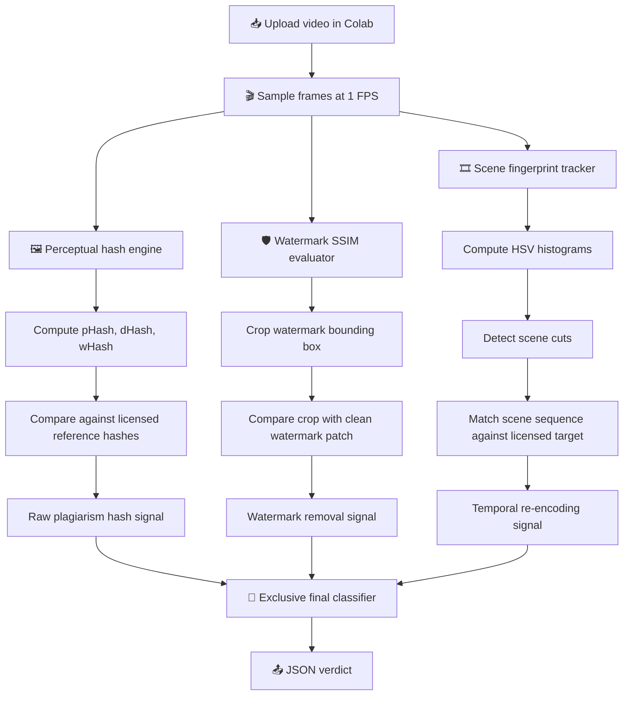

# 🎥 Track 1 Video Anomaly Scanner

**Track 1 Pipeline Logic & Dataflow** is a Colab-first video forensics prototype for detecting three common forms of video misuse:

- 🖼️ **Frame-level plagiarism**
- 🛡️ **Watermark removal / tampering**
- 🎞️ **Re-encoding of licensed clips**

The project is designed for experimentation, demos, and pipeline validation. It uses uploaded MP4 videos, OpenCV frame sampling, perceptual hashing, SSIM, and temporal scene fingerprinting to produce a structured JSON verdict.

---

## 🎯 Project Goal

Bad actors can bypass simple file checks like MD5/SHA256 by resizing, recompressing, cropping, blurring, changing timestamps, or removing watermarks. This project detects those behaviors at the visual and temporal level instead of relying on raw file identity.

The scanner answers:

```text
Does this uploaded video visually copy a licensed source?
Was the watermark region erased or patched?
Does the scene sequence match a licensed clip after re-encoding?
```

---

## ✨ Features

- 📥 Upload videos directly in Colab. No manual file path needed.
- 🎬 Samples video frames at 1 FPS using OpenCV.
- 🖼️ Computes three perceptual hashes:
  - `pHash` for structural similarity
  - `dHash` for edge-gradient similarity
  - `wHash` for frequency/wavelet-style similarity
- 🛡️ Detects watermark removal using localized SSIM.
- 🎞️ Detects scene-level licensed-clip reuse using temporal fingerprints.
- 🧪 Generates playable H.264 `.mp4` test fixtures.
- 🧠 Supports a **virtual licensed target** for synthetic fixture testing.
- 📊 Outputs structured JSON with metrics and debug artifacts.
- ✅ Uses exclusive final labels:

```text
watermark_removal > plagiarism > reencoding
```

---

## 🧱 Repository Structure

```text
.
├── README.md
├── track1_colab.ipynb
└── examples/
    ├── generate_playable_mp4_fixtures_colab.py
    └── generate_test_videos.ps1
```

### Purpose of Each File

| File | Purpose |
|---|---|
| `track1_colab.ipynb` | Main self-contained Colab notebook for scanning uploaded videos. |
| `examples/generate_playable_mp4_fixtures_colab.py` | Generates playable H.264 MP4 test videos and reference assets in Colab. |
| `examples/generate_test_videos.ps1` | Optional Windows/PowerPoint-based local MP4 fixture generator. |
| `README.md` | Project documentation and usage guide. |

---

## 🧠 Detection Modules

### 🖼️ 1. Plagiarism Detection

Detects frame-level visual copying even if the video has been resized, recompressed, or slightly degraded.

**Input:**

- Uploaded suspect video
- Clean master video, reference hash JSON, or virtual licensed target

**Core logic:**

1. Sample frames at 1 FPS.
2. Compute `pHash`, `dHash`, and `wHash`.
3. Compare sampled frame hashes against licensed reference hashes.
4. Measure similarity with Hamming distance.

**Final label:**

```json
{
  "plagiarism": true
}
```

---

### 🛡️ 2. Watermark Removal Detection

Detects attempts to blur, erase, patch, or inpaint a watermark/logo region.

**Input:**

- Uploaded suspect video
- Watermark reference image, clean master video, or virtual target
- Watermark bounding box

**Core logic:**

1. Crop the expected watermark region.
2. Convert the crop to grayscale.
3. Compare it with a pristine watermark patch using SSIM.
4. If SSIM drops below the threshold, flag watermark removal.

**Final label:**

```json
{
  "watermark_removal": true
}
```

---

### 🎞️ 3. Re-Encoding Detection

Detects licensed clip reuse when the upload is not a direct frame-level copy but still follows the licensed scene timeline.

**Input:**

- Uploaded suspect video
- Licensed master video, licensed fingerprint JSON, or virtual target

**Core logic:**

1. Compute HSV histograms for sampled frames.
2. Detect scene boundaries from large histogram shifts.
3. Build a scene fingerprint from:
   - scene durations
   - representative frame hashes
4. Compare the sequence against a licensed fingerprint.

**Final label:**

```json
{
  "reencoding": true
}
```

---

## 🔢 Maths Used

### 1. Hamming Distance

Used for perceptual hash comparison.

```text
Hamming Distance = sum(bit_query XOR bit_reference)
```

Low distance means two frames are visually similar.

Default threshold:

```python
HASH_THRESHOLD_BITS = 8
PLAGIARISM_STRICT_AVG_DISTANCE = 4.0
```

The raw hash matcher can still fire for watermark-removal videos because the global frame is mostly unchanged. The final classifier prevents double-labeling by prioritizing watermark removal over plagiarism.

---

### 2. SSIM

Used for localized watermark verification.

SSIM compares:

- luminance
- contrast
- structure

Output range:

```text
-1 to +1
```

Interpretation:

| SSIM Score | Meaning |
|---|---|
| `1.0` | Perfect match |
| `0.75+` | Usually intact |
| `< 0.75` | Likely altered/tampered |
| `< 0` | Strong structural mismatch |

Default threshold:

```python
SSIM_THRESHOLD = 0.75
```

---

### 3. HSV Histogram Shift

Used for scene boundary detection.

The notebook computes HSV histograms and compares consecutive frames using chi-square distance:

```text
0.5 * sum((hist_a - hist_b)^2 / (hist_a + hist_b + epsilon))
```

Default scene boundary threshold:

```python
SCENE_CUT_THRESHOLD = 0.45
```

---

## 🧭 Pipeline Flowchart



---

## 🧠 Final Classification Logic

The notebook uses exclusive final labels so a single test case does not produce confusing duplicate detections.

Priority:

```text
watermark_removal > plagiarism > reencoding
```

Meaning:

- If watermark removal is detected, final output is watermark removal only.
- If no watermark removal and frames are near-identical, final output is plagiarism.
- If no watermark removal and no direct plagiarism, but the temporal scene sequence matches, final output is re-encoding.

Raw diagnostic signals are still shown in metrics:

```json
{
  "plagiarism_hash_match_raw": true,
  "temporal_sequence_match": false
}
```

These are not the final classification.

---

## 🧪 Generate Playable MP4 Test Fixtures

Run this in Colab:

```python
!python examples/generate_playable_mp4_fixtures_colab.py
```

It creates H.264 `.mp4` files with `yuv420p` pixel format, which should play in Windows Media Player, VLC, Chrome, and Colab preview.

Generated structure:

```text
examples/generated_mp4_fixtures/
├── normal/
│   ├── licensed_master_clean.mp4
│   └── original_upload_clean.mp4
├── defective/
│   ├── frame_level_duplication.mp4
│   ├── watermark_removal_attempt.mp4
│   └── reencoding_licensed_clip_bypass.mp4
├── watermark_reference.png
├── reference_hashes_master.json
├── licensed_fingerprints_master.json
└── fixture_manifest.json
```

---

## 📥 Input Options

### Option A: Two-Video Flow

Upload a clean master plus one suspect video.

#### Plagiarism Test

```text
licensed_master_clean.mp4
frame_level_duplication.mp4
```

Expected:

```json
{
  "plagiarism": true,
  "watermark_removal": false,
  "reencoding": false
}
```

#### Watermark Removal Test

```text
licensed_master_clean.mp4
watermark_removal_attempt.mp4
```

Expected:

```json
{
  "plagiarism": false,
  "watermark_removal": true,
  "reencoding": false
}
```

#### Re-Encoding Test

```text
licensed_master_clean.mp4
reencoding_licensed_clip_bypass.mp4
```

Expected:

```json
{
  "plagiarism": false,
  "watermark_removal": false,
  "reencoding": true
}
```

---

### Option B: Virtual Target Flow

The notebook can simulate the clean licensed master internally.

Keep this enabled:

```python
USE_VIRTUAL_LICENSED_TARGET = True
```

Then upload only one generated defective video:

```text
frame_level_duplication.mp4
```

or:

```text
watermark_removal_attempt.mp4
```

or:

```text
reencoding_licensed_clip_bypass.mp4
```

The notebook builds reference hashes, watermark reference, and temporal fingerprints from the synthetic virtual target.

---

### Option C: Reference Asset Flow

Upload a suspect video plus explicit reference files:

```text
watermark_removal_attempt.mp4
watermark_reference.png
reference_hashes_master.json
licensed_fingerprints_master.json
```

Use this when you want deterministic database-style matching instead of using a master video.

---

## 📤 Output Format

Example output:

```json
{
  "status": "anomaly_flagged",
  "scanned_file": "watermark_removal_attempt.mp4",
  "detections": {
    "plagiarism": false,
    "watermark_removal": true,
    "reencoding": false
  },
  "analytical_metrics": {
    "total_frames_sampled": 8,
    "average_phash_hamming_distance": 7.0,
    "plagiarism_hash_match_raw": true,
    "average_watermark_ssim_score": -0.085,
    "detected_scene_cuts_count": 3,
    "temporal_sequence_match": false,
    "processing_latency_ms": 2106.8
  },
  "configuration_warnings": [],
  "debug_artifacts": {
    "scene_fingerprint": [],
    "sample_hashes": []
  }
}
```

### Output Field Meaning

| Field | Meaning |
|---|---|
| `status` | `clean` or `anomaly_flagged`. |
| `scanned_file` | Uploaded video selected for scanning. |
| `detections.plagiarism` | Final plagiarism label. |
| `detections.watermark_removal` | Final watermark removal label. |
| `detections.reencoding` | Final re-encoding label. |
| `average_phash_hamming_distance` | Average pHash distance against reference frames. |
| `plagiarism_hash_match_raw` | Raw hash match signal before final priority rules. |
| `average_watermark_ssim_score` | Average SSIM score for the watermark crop. |
| `detected_scene_cuts_count` | Number of detected temporal scene transitions. |
| `temporal_sequence_match` | Raw temporal licensed-sequence match. |
| `configuration_warnings` | Notes about auto-built or missing references. |
| `debug_artifacts` | Hashes and fingerprints useful for inspection. |

---

## ⚙️ Tech Stack

| Layer | Technology |
|---|---|
| Runtime | Google Colab |
| Language | Python |
| Video processing | OpenCV |
| Numeric processing | NumPy |
| Fixture encoding | FFmpeg in Colab |
| Output format | JSON |
| Video format | H.264 MP4, `yuv420p` |

---

## 🚀 How to Operate

1. Open `track1_colab.ipynb` in Google Colab.
2. Run the dependency install cell.
3. Upload your test video or video pair.
4. Check that the notebook prints the correct selected video:

```text
Selected video: frame_level_duplication.mp4
Master reference video: licensed_master_clean.mp4
```

5. Run all remaining cells.
6. Read the final JSON under `detections`.

---

## 🧯 Troubleshooting

### The result is `clean` when it should not be

Check `configuration_warnings`. If references were missing and virtual target is off, the checks may have been skipped.

### The clean master was scanned instead of the defective video

Upload the clean master and defective video together. The notebook auto-selects the non-master video as the scan target.

### Watermark removal also triggers raw plagiarism

That can happen because the whole video is still visually similar. The final classifier suppresses plagiarism when watermark removal is detected.

### Re-encoding also looks like a scene match for copied clips

The notebook treats temporal sequence matches as re-encoding only when the clip is not already classified as plagiarism or watermark removal.

---

## 📌 Notes

- This is a prototype scanner, not a production moderation system.
- Thresholds should be tuned on real datasets.
- The generated fixtures are synthetic but intentionally shaped to demonstrate the three anomaly classes.
- No scraping is required.
- Colab execution is preferred so dependencies and generated media stay isolated from the local machine.

